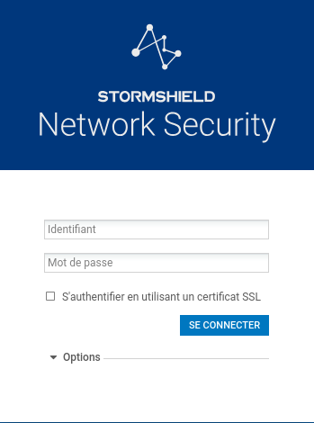

# Configuration d'un firewall

## Réinitialisation d'un firewall Stormshield

### 1. Mise sous tension

Commencez par brancher l'alimentation électrique du firewall Stormshield.

### 2. Réinitialisation du firewall

À l'aide d'un objet fin et rigide, comme un trombone, appuyez sur le bouton de réinitialisation du firewall.

Attendez que les **trois voyants** soient de nouveau allumés avant de poursuivre.

### 3. Connexion au firewall

Connectez votre ordinateur au firewall à l'aide d'un câble **RJ45**.

Branchez le câble sur l'interface **LAN**, correspondant au **port n°2** du firewall.

### 4. Accès à l'interface d'installation

Ouvrez un navigateur Internet et saisissez l'adresse suivante :

https://10.0.0.254/install

Suivez les différentes étapes affichées à l'écran afin de terminer l'installation du firewall.

### 5. Connexion à l'interface d'administration

Une fois l'installation terminée, accédez à l'interface d'administration à l'adresse suivante :

https://10.0.0.254/admin

Utilisez les identifiants suivants pour vous connecter :

* **Utilisateur :** `admin`
* **Mot de passe :** `admin`

##

# Mise à jour du firmware d'un firewall Stormshield

### 1. Modifier temporairement la date du système

Depuis l'interface d'administration du **Stormshield**, accédez aux paramètres de date et d'heure du système.

Modifiez temporairement la date afin de définir une date située en **2025**.

> **Pourquoi utiliser une date en 2025 ?**
> Cette modification permet de replacer temporairement le système dans une période compatible avec les droits de maintenance associés au boîtier.

---

### 2. Redémarrer le firewall

Après avoir modifié la date, effectuez un **redémarrage complet du firewall**.

Ce redémarrage permet aux différents services du Stormshield de prendre correctement en compte la nouvelle date système.

Une fois le redémarrage terminé :

1. reconnectez-vous à l'interface d'administration ;
2. vérifiez que la date configurée correspond bien à celle définie précédemment ;
3. assurez-vous que le firewall fonctionne normalement.

---

### 3. Installer la mise à jour du firmware

Vous pouvez maintenant procéder à l'installation du **firmware prévu pour le modèle de boîtier concerné**.

#### Vérifications préalables

Avant de lancer la mise à jour, vérifiez impérativement les éléments suivants :

* **Modèle du boîtier** ;
* **Version actuelle de SNS** ;
* **Compatibilité de la version cible** avec le boîtier ;
* **Sauvegarde récente de la configuration**.

Une fois ces vérifications effectuées, lancez la procédure de mise à jour.

> ⚠️ **Attention :**
> La mise à jour peut entraîner plusieurs redémarrages du firewall.
> **Ne débranchez pas et ne coupez pas l'alimentation du boîtier pendant l'opération.**

Attendez la fin complète de la mise à jour avant d'effectuer toute autre manipulation.

---

### 4. Rétablir la date et l'heure actuelles

Une fois la mise à jour terminée et le firewall redémarré :

1. reconnectez-vous à l'interface d'administration ;
2. accédez aux paramètres de **date et heure** ;
3. rétablissez **la date et l'heure actuelles** ;
4. vérifiez la configuration de la synchronisation **NTP**, si celle-ci est utilisée ;
5. contrôlez que la date et l'heure affichées par le système sont correctes.

> **Important :**
> N'oubliez pas de rétablir la date réelle après la mise à jour afin d'éviter tout problème lié aux certificats, aux journaux système ou aux différents services du firewall.

---

### 5. Vérifications finales

Après la mise à jour, effectuez quelques contrôles afin de vous assurer que le firewall fonctionne correctement :

* Vérifier la **version du firmware/SNS** installée ;
* Vérifier la **date et l'heure du système** ;
* Vérifier l'état des **interfaces réseau** ;
* Vérifier la connectivité réseau ;
* Vérifier que les principales règles de filtrage sont toujours présentes ;
* Vérifier que la configuration sauvegardée est correctement appliquée.

La mise à jour est terminée lorsque l'ensemble de ces vérifications est conforme.
