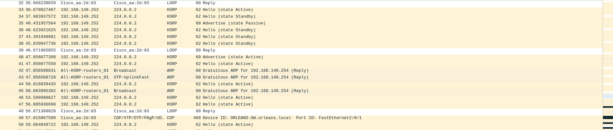
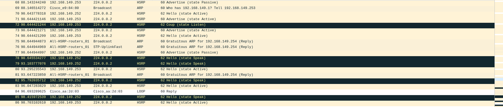

# HSRP 


**HSRP** (Hot Standby Router Protocol) est un protocole propriétaire Cisco de redondance de la passerelle par défaut.

Dans un groupe HSRP :

- le routeur **Active** transmet les paquets envoyés à la passerelle virtuelle ;
- le routeur **Standby** surveille l'Active et se tient prêt à prendre le relais ;
- les autres routeurs éventuels restent à l'état Listen ;
- les postes utilisent une seule adresse IP virtuelle et une seule adresse MAC virtuelle.


## Configuration HSRP

Tout d'abord il faut choisir quel routeur sera le **Active** avec le nombre de priorité

*R1*
```
standby 1 ip 'ip virtuelle' 
standby 1 priority 110
standby 1 preempt
```

Les paramètres suivants doivent être cohérents sur les deux équipements :

- le même numéro de groupe HSRP : 1 ;
- la même adresse IP virtuelle : 172.28.x.254 ;
- le même sous-réseau IP sur l'interface LAN.
- et forcement le même réseau de niveau 2 (même domaine de diffusion = même vlan)

*R2*
```
standby 1 ip 'même ip virtuelle que R1'
standby 1 priority 100
standby 1 preempt
```

Le routeur qui aura le plus nombre de priority sera le routeur **Active** et l'autre sera en **Standby** prêt à prendre la main si l'autre tombe en panne.

Le choix de la priorité (`priority`) est très important. En effet, lorsque le routeur actif perd la liaison surveillée, sa priorité peut diminuer de 20 points grâce au mécanisme de suivi d'interface (interface tracking).

Par exemple, si le routeur actif possède une priorité de 110, celle-ci passe à 90, ce qui est inférieur à la priorité de 100 du routeur en veille. Ce dernier peut alors prendre le relais.

En revanche, si la priorité du routeur actif est de 130, elle descend à 110, ce qui reste supérieur à la priorité de 100 du routeur en veille. Le routeur en veille ne prendra donc pas automatiquement le relais en raison de cette diminution de priorité.

## Exemple prise en main du routeur Standby



Sur cette image, au-dessus, on peut voir que le routeur R1 (192.168.149.253) est en *state Active* et le routeur R2 (192.168.149.252) en *state Standby*. Puis on voit R2 prendre la main en passant en *state Active*



Et dans cette image on voit R1 reprendre *state Active* et R2 repasser en *state Passive*